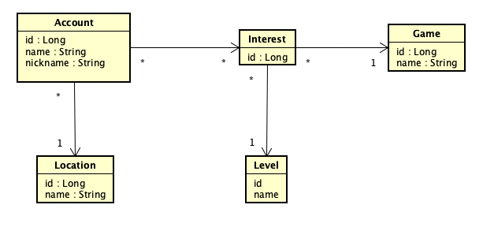

## GAMERS API


## 📄 About

A directory of gamers and their favorite games and respective level.


### Domain model design

An Account has a list of Interests that are composed of a Game and a Level for that specific Game.

The Account has also a name, a nickname and a Location.

The available locations, games and levels are pre-defined.

If the payload for creating an Account has different values than those pre-defined, the sign up process will fail.

#### Domain model mapped




## ⚙️ Running the API locally

1. Clone the repo
2. Make sure to import all maven dependencies
3. Run the GamersApiApplication class

a) The OpenAPI Swagger documentation is configured and can be access at:

http://localhost:8080/swagger-ui/index.html

b) The app has an in-memory database configured using H2 database and its own UI.

- To access the H2 UI and visualize tables and data, go to http://localhost:8080/h2-console/

- Login with:
1. JDBC URL: jdbc:h2:mem:gamers-db
2. User Name: sa
3. Password:
4. Click Connect

## ⚙️ Running the test

It is possible to run the test in two ways.

1. Run the tests in the Terminal/Console with the command:

```mvn clean test```

2. a) Navigate to src/test/java
   
   b) Right click and select " Run 'All Tests' "


